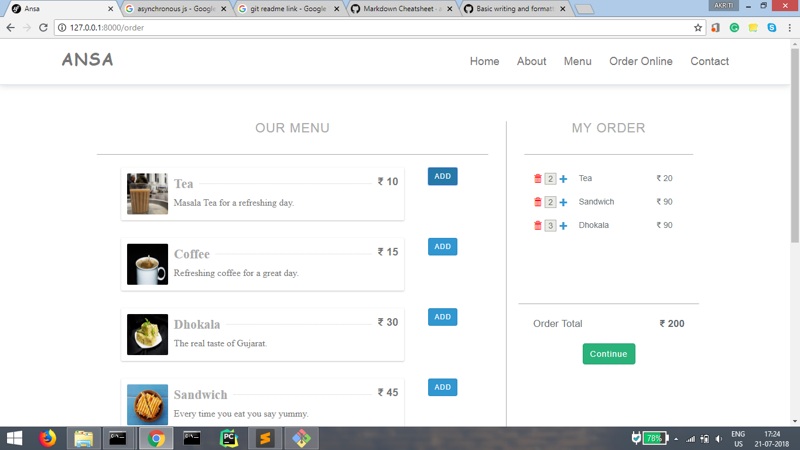

## Ansa
Ansa is a web application for a restaurant to order food stuffs online. It a client-based project. It consists of a website for the users
and a cross-platform mobile application for the Admin.

## Stack
- React Js
- Laravel Rest API
- React Native

## Highlights
- Asynchronous Functionalities
- User friendly
- Cross-Platform Mobile App 

## Contributors
- [Akriti Bhadoriya](https://github.com/Akriti3011)
- [Deepak Goyal](https://github.com/DeepakGoyal468)
