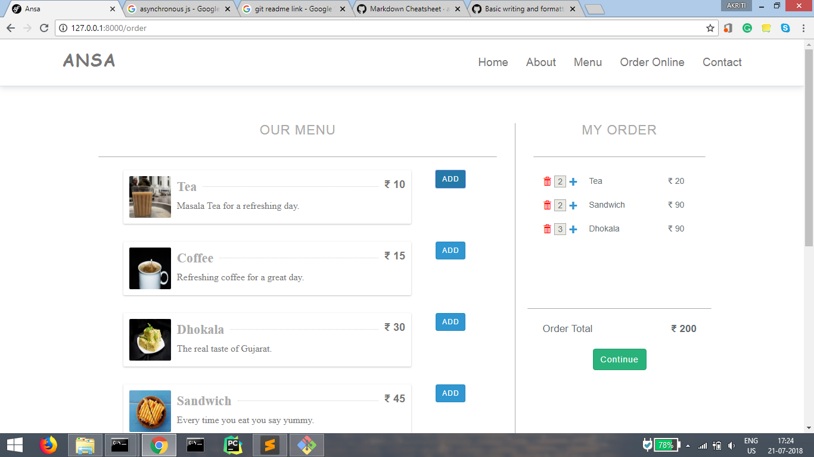

## Ansa
Ansa is a web application for a restaurant to order food stuffs online. It a client-based project.

## Stack
- React Js
- Laravel Rest API

## Highlights
- Asynchronous Functionalities
- User friendly

## Contributors
- [Akriti Bhadoriya](https://github.com/Akriti3011)
- [Deepak Goyal](https://github.com/DeepakGoyal468)
